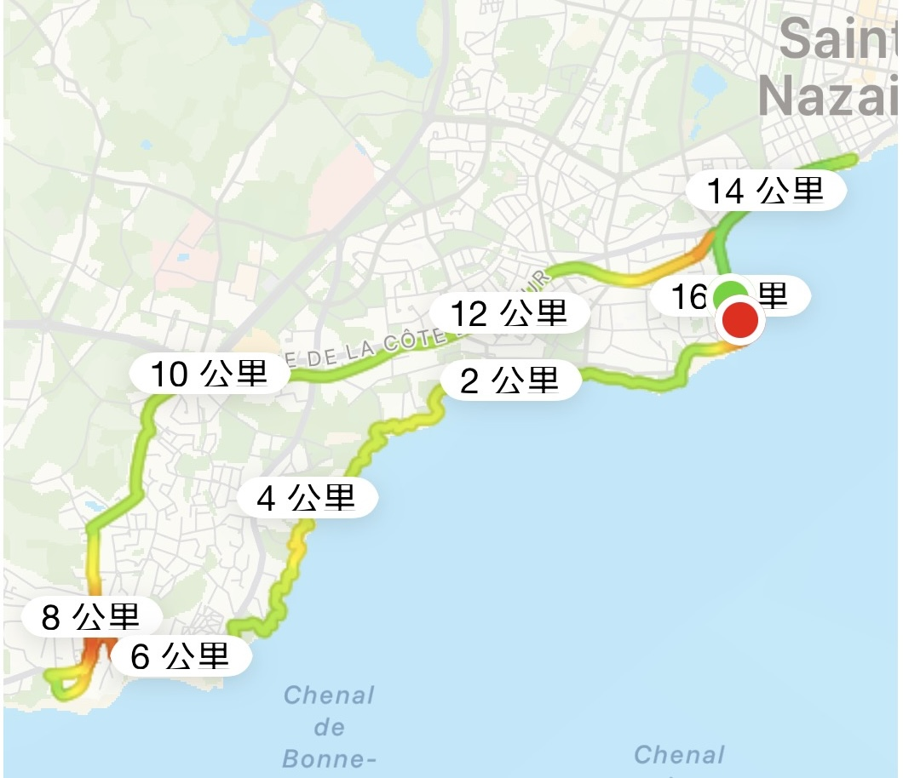

    

        Une course de 10 km_15/03/26
    

    4 km : La fatigue frappe. 
    5 km : Le mental flanche. Envie de se contenter de 6 ou 8 km. 
    6 km : La volonté rappelle aux jambes qu'il faut continuer au moins jusqu'à 8 km. 
    8 km : Envie de se reposer, mais les 10 km sont un véritable palier. Sans s'arrêter. 
    9 km : Serrer les dents : « Les derniers pas sont les plus difficiles — 行百里者半九十 ». 
    10 km : Les jambes refusent d'avancer, mais elles n'ont plus le choix face à la victoire! 

 

    

        Une course de 13 km_15/03/26
    

    1 km : Équipement neuf. Foulée légère. 
    2 km : Un exercice de manths de primaire pour passer le temps. 
    3 km : Longue montée. Je ralentis, tout va bien. 
    4 km : Flash-back sur ma dernière année de thèse (4 km/jour). C'est facile aujourd'hui. 
    5 km : Vend d'ouest, regard fixé sur le bitume gris. La magie du running : l'espace s'accélère, le temps se fige. Explorer l'immensité dans une vie finie.  
    5.5 km: Au bureau. Pause tactique et une heure de travail.  
    6 km: Retour sous la pluie. Plus c'est dur, plus je fonce. C'est l'heure du dépassement. 
    7-10 km: La pluie s'intensifie, l'allure augement. Arrivée face à la mer. 
    10 km: L'ancienne limite n'est plus qu'un nouveau départ. Energétique et le moral est au plus haut.  
    10-13 km: Course dans le noir, la joie au coeur. Fin de parcours 
    Synthèse: La peur est humaine. Il suffit de s'élancer, de rester prudent et d'oser 

 

    

        Une course de 16 km_07/04/26
    

    

        
    

    0公里：从衣柜里取出还带着洗涤剂香味的T恤和短裤，捎带仪式感和感激，夕阳西下，海风拂面，目标16公里 
    1公里：穿过Villès沙滩水泥路面，进入临海的Remblais  
    3公里：路过Porcé沙滩，大海在左侧拍打岩石，脚下的灰色石子和泥沙被踩得咯吱作响，没有耳机，没有音乐  
    5公里：太多陡峭的石头台阶，上坡下坎，体力耗费巨大，一行十来人的跑步队伍，从身边经过，尾随其后；夏洛特沙滩的岩石板路，太结实，太凹凸不平，太有意思；再次抵达18世纪建造的Aiguillon灯塔  
    6公里：抵达巨大的Courance沙滩，Remblais道路结束，突然丢失了方向，在沙滩步行徘徊  
    7公里，向西步行一公里，沿途坐北朝南、面朝大海的独栋大别墅，惊艳了视线，抵达Saint Marc Sur Mer小镇，小跑到Hulot沙滩，在小镇步行一公里，开启回程  
    8公里：沿着熟悉的道路，路过中午经常光顾的面包店、Océanis环岛、Côté d'Amour新修的道路，一路向东  
    11公里，语音提示只剩下5公里，开始思考是一口气跑完还是步行休息一公里再继续，脑子里突然闪过重量级拳击比赛的画面，要保存实力，不被击倒，要一直站在台上  
    13公里：来到在LIDL超市，慢下节奏，步行1公里，让呼吸慢下来  
    14公里：酸疼的膝盖再启动，只剩下2.5公里，和上次的13公里不同，今天需要意志力和给自己默默加油才能获得继续迈开步子的力量  
    16.1公里：新目标在沙滩音乐、霓虹灯和呼呼作响的海浪声中完成，内心只剩下开心 
    总结：生命只有一次，如果不能精彩，那就体会痛苦，拒绝平庸。 
    La traduction suivante est faite par ChatGPT 
    0 km : Sorti du placard un t-shirt et un short encore parfumés à la lessive. Un petit rituel, mêlé de gratitude et d'un certain sens de la cérémonie. Soleil couchant, brise marine sur le visage. Objectif: 16 km. 
    1 km: Traversé la promenade bétonnée de la plage de Villès, puis rejoint les Remblais en bord de mer. 
    3 km: Passé devant la plage de Porcé. A gauche, l'océan frappe les roches. Sous les pieds, galets gris et sable crissent à chaque foulée. Ni écouteur, ni musique. 
    5 km: Trop de marches rocheuses abruptes, montées et descentes incessantes; énorme dépense d'énergie. Un groupe d'une dizaine de coureurs dépasse; pris leur sillage. Le chemin rocheux de la plage de Charlotte: solide, irréguiler, fascinant. Arrivée une nouvelle fois au phare de l'Aiguillon, construit au 18e siècle. 
    6 km: Atteint l'immense plage de la Courance. Fin des Remblais. Perdu soudain le sens de l'orientation; erré quelque temps sur la plage. 
    7 km: Marché un kilomètre vers l'ouest. Tout aulong du chemin, superbes villas individuelles tournées vers le sud et l'océan, spectacle saisissant. Arrivé à Saint-Marc-sur-Mer. Petit footing jusqu'à la plage de Monsieur Hulot, puis un kilomètre de marche chans le bourg avant d'entamer le retour. 
    8 km: Retrouvé des routes familières. Passé devant la boulangerie où je déjeune souvent, le ront-point Océanis et la nouvelle voie de la Côté d'Amour (quel beau nom). Direction l'est. 
    11 km: Annonce vocal de mon smartphone: plus que 5 km. Hésitation: finir d'une traite ou marcher un kilomètre avant de repartir. Une image surgit alors: un combat de boxe poinds lourd. Garder des réserves. Ne pas tomber. Rester debout sur le ring jursqu'au bout. 
    13 km: Arrivé au LIDL. Ralenti le rythme. Merché un kilomètre pour laisser la respiration retrouver son calme. 
    14 km: Genoux douloureux. Redémarrage. Plus que 2.5 km. Contrairement aux 13 km de la dernière fois, impossible aujourd'hui d'avancer sans volonté. Chaque pas demande un encouragement silencieux à soi-même. 
    16.1 km: Nouvel objectif atteint au milieu de la musique de plage, des néons et du grondement continu des vagues. Ne reste plus que la joie. 
    Conclusion: On ne vit qu'une seule fois. Si la vie ne peut être extrordinaire, alors qu'elle soit au moins intensément vécue dans l'effort et la douleur. Refuser la médiocrité. 

