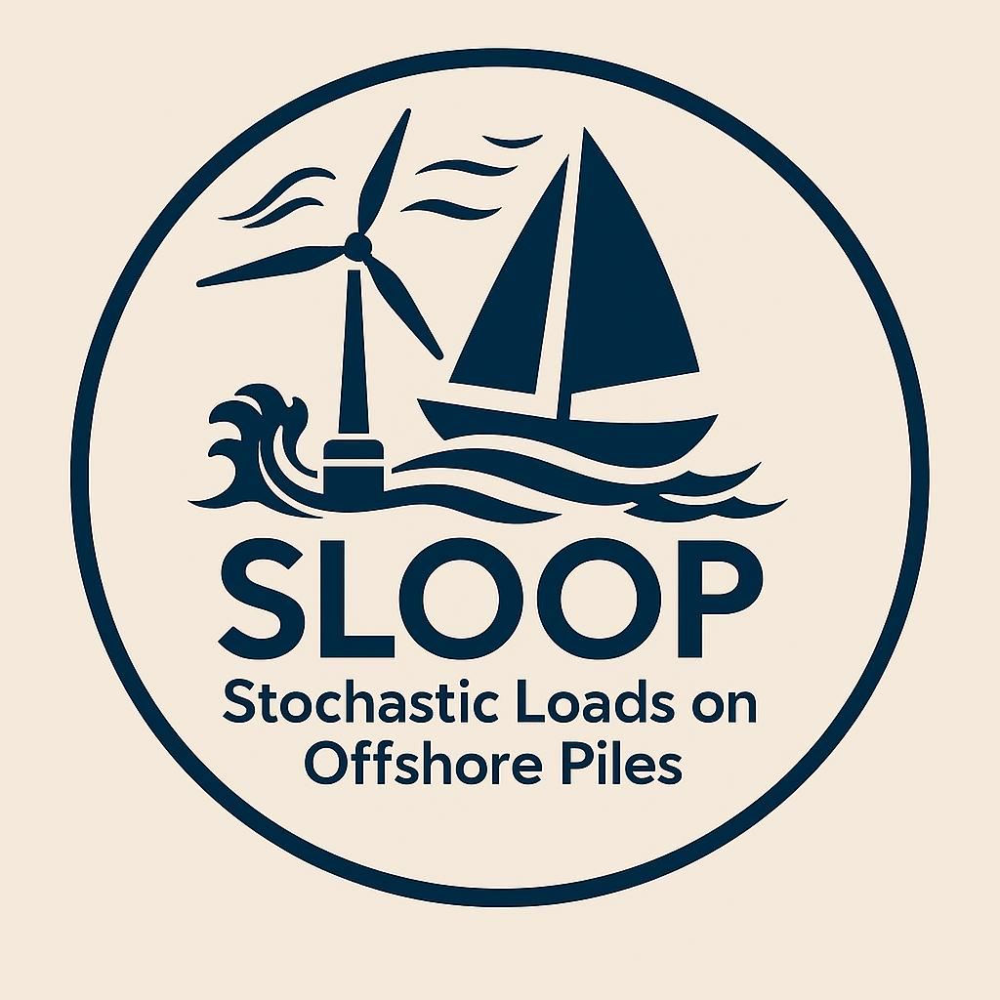

# SLOOP project receives funding from LabEx ORACLE program

    

SLOOP Project receives positive feedback from LabEx ORACLE program on May 22nd, 2025. With the two-year finantial support, the project will gather local geotechnical and hydrodynamic researchers in the Nantes region, and international experts from Brasil, France and USA. The project will investigate the stochastic loads exerted on offshore piles through aero-hydrodynamic simulations, and the pile deflections through centrifuge tests (SOLCYP+ project) and geotechnical modelling. The dedicated web-page for the project will be lauched in early 2026.

