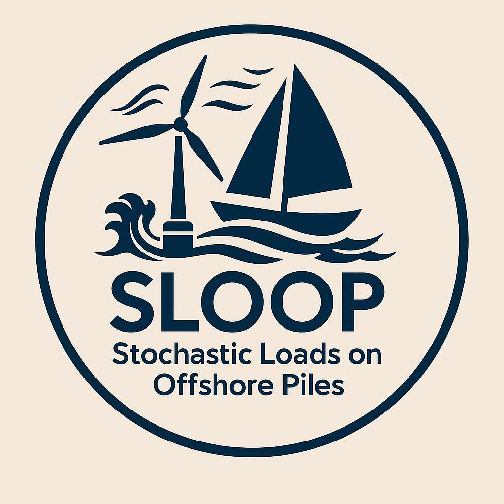

    

        
    

    

        SLOOP Project receives funding from LabEx ORACLE
    

    SLOOP Project receives positive feedback from LabEx ORACLE program on May 22, 2025. With the two-year financial support, the project will gather geotechnical and hydrodynamic researchers from Nantes, Paris, Brasil, and the USA. The project will investigate the stochastic loads exerted on offshore piles through aero-hydrodynamic simulations, and the pile deflections through centrifuge tests (SOLCYP+ project) and geotechnical modelling.  
    

        WP1 Monopile load calculation
    

    

        
    

    ▪ In <strong>Task 1.1</strong>, linear and nonlinear hydrodynamic load analysis will be performed. Linear hydrodynamic loads for the bottom-mounted rigid structure are modelled using NEMOH software, which is an in-house wave diffraction-radiation code based on potential flow theory. The computation of internal loads, including hydroelastic responses of the flexible structure will be further developed based on a modal approach. For nonlinear wave loads, Morison’s equation will be applied in conjunction with the nonlinear wave method, HOS-NWT. Additionally, a servo-aerodynamic solver (OpenFAST, Qblade) will be used to calculate the aerodynamic loads acting on the rotor-nacelle assembly, specifically using the IEA 15 MW wind turbine. The contribution of load components on monopile structures will subsequently be characterised for both linear and nonlinear/hydrodynamic and aerodynamic loads. 
    ▪ In <strong>Task 1.2</strong>, stochastic loadings for aero-hydrodynamic elements will be assessed under extreme design conditions. These loading conditions are determined by examining rated wind and parked conditions as proposed by the International Electrotechnical Commission (IEC) to identify extreme scenarios. The analysis will focus on constructing stochastic loading using the aero-hydrodynamic models from Task 1.1, with particular interest on the overturning moments under uni-directional and multi-directional waves, as well as under wind-wave misalignments. Lastly, a design wave approach will be investigated, which enables the identification of a particular wave set, condensing statistical events into a single wave profile to minimise required number of stochastic simulations.  
    

        WP2 Monopile deflection analysis
    

        

        
    

    ▪ In <strong>Task 2.1</strong>, experimental data, carried out at the centrifuge facility, will be collected in respect of the confidentiality. The value of those data lies in its application of cutting-edge strain measurement technology – fibre Bragg gratings – which improve representativeness and accuracy. In-house MATLAB code will be developed to interpret the soil-pile interaction following a progressive methodology, i.e. from one-way cyclic to multidirectional monotonic and multidirectional cyclic and finally achieve to stochastic loads. 
    ▪ In <strong>Task 2.2</strong>, the soil-pile interaction will be carefully simulated via a three-dimensional finite element numerical modelling which involves advanced soil constitutive laws such as hypoplastic and SANISAND. Like the centrifuge data analysis, the numerical simulation will follow an easy-to-difficult principle, starting from one-way cyclic loading to multidirectional cyclic before reaching out the stochastic loads. 
    ▪ In <strong>Task 2.3</strong>, the afore-mentioned experimental and numerical results will be used to calibrate the HARM model parameters mainly dedicated to cyclic loads. The development of a more complex model dealing with stochastic load requires the combination of HARM with other models considering multi-directionality. This seems challenging due to the limited duration of the project, but a following-up project is envisaged to advance this aspect.  
    

        Project timeline and deliverables
    

    

        
    
 
    

        Project News
    

    ▪ <strong>2025-09-11</strong>: The SLOOP project officially launched with its kick-off meeting. The event brought together eight researchers representing Bureau Veritas, École Centrale de Nantes, Nantes Université, the University of São Paulo, and the University of Massachusetts. 
    ▪ <strong>2025-11-27</strong>: The SLOOP project presented its major objectives, work packages, and organisation at École Centrale de Nantes for the LabEx ORACLE Scientific Day. 
    ▪ <strong>2026-03-27</strong>: The SLOOP project interviewed seven short-listed candidates for the post-doctoral position entitled "Offshore Pile Load and Deflection Analysis". The project received nearly forty applications. We sincerely thank all the applicants for their interest and efforts. 
    ▪ <strong>2026-05-19</strong>: The SLOOP project is participating in the Research Posters session at the Seanergy 2026 Conference held in Nantes. <a href="https://univnantesfr-my.sharepoint.com/:b:/g/personal/li-z-1_univ-nantes_fr/IQCrLg6zn9DRQKAkWedKGOqTAd4i550oJI0vIOj-kyvmQz0?e=IP2q7h" target="_blank">Click here</a> to view our poster. 
    

    <footer style="text-align: center; font-size: 13px; color: #666; margin-bottom: 20px; line-height: 1.6;">
        By ZSLi &nbsp;|&nbsp; 
        &copy; 2025-2026 SLOOP Project. All Rights Reserved.
    </footer>

